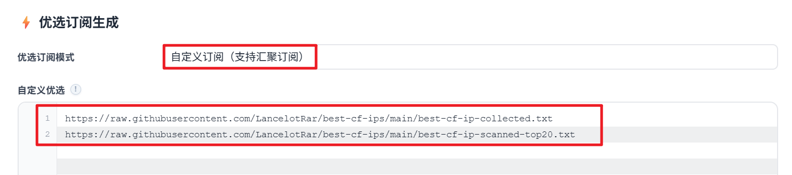
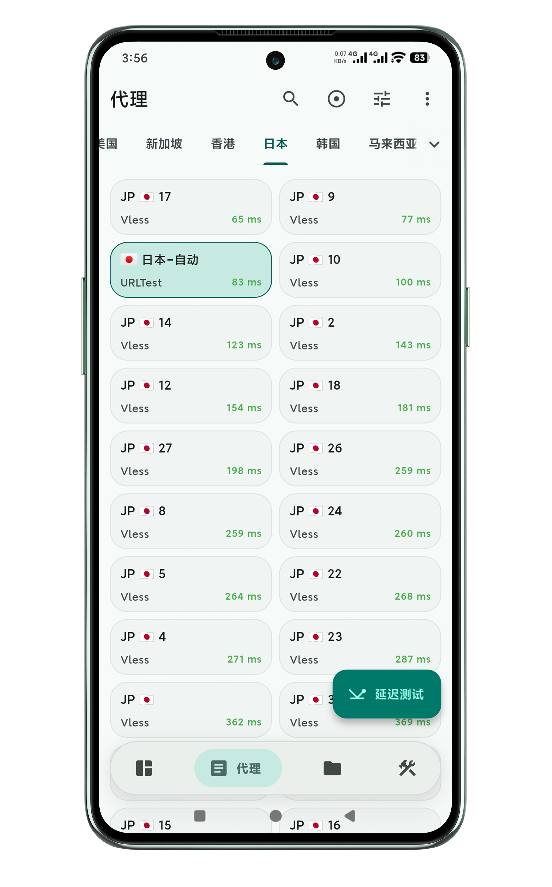
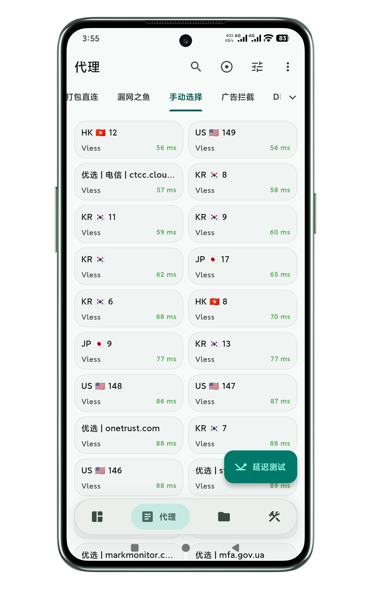
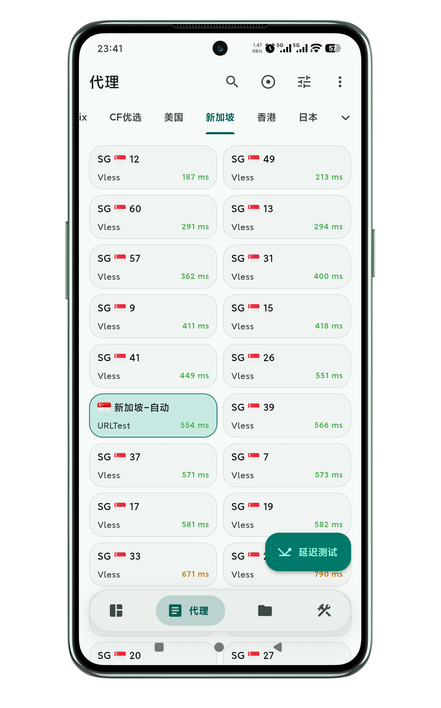
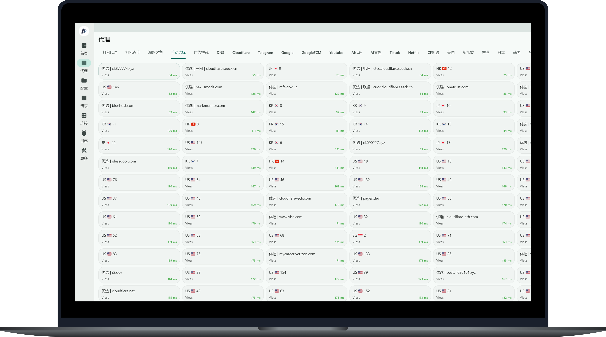
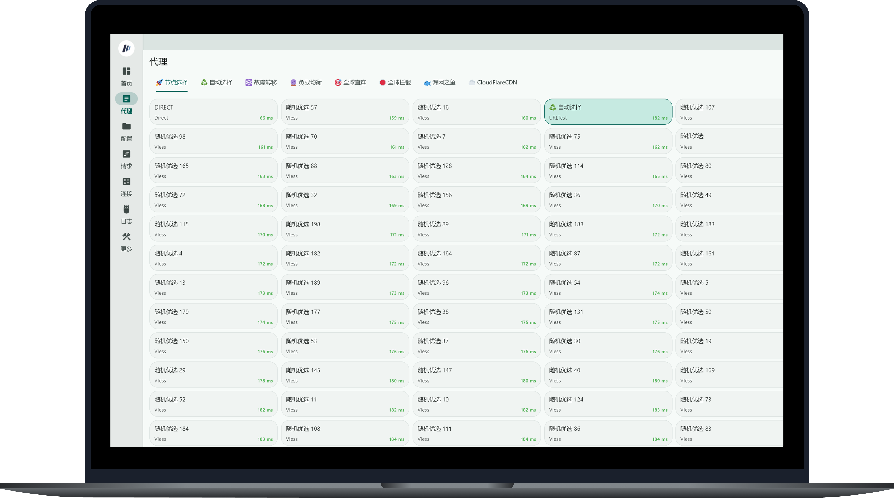
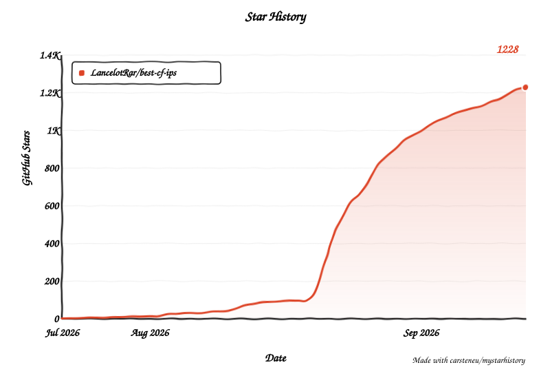

# Cloudflare 优选IP API（IPV4）

## 为 Cloudflare 提供优选 IP 代理节点的 API 项目

> [!IMPORTANT]
> **友情提示：优选域名 API 已迁移至新仓库 [best-cf-domains](https://github.com/LancelotRar/best-cf-domains)**

## 项目说明

- 提供 “**优选 IP 聚合 API**”：为多个公开或开源 Cloudflare 优选 IP 项目进行**聚合&去重&加国家区域标注&加旗帜**，每3小时更新。
- 提供 “**随机优选 API**”：仅标注“随机优选”，无国家标注，提供3档 IP 数量不同的 API，满足期望“小而美”的用户，每3小时更新。
- 两类优选 API ，IP 内容不同，数量不同，互不相属，可同时添加，实际效果同样出色。
- 两类优选 API 均可接入 [cmliu/edgetunnel](https://github.com/cmliu/edgetunnel)-自定义订阅汇聚。

<p align="center">
  
</p>

- [Cloudflare anycast IP 机制须知](https://github.com/LancelotRar/best-cf-ips/issues/3#issuecomment-5508271687) 

## 项目初衷

- 为优选 IP 建立**国家区域、旗帜**标识，有助于按国家区域筛选 CF 节点。如使用 Mihomo 代理客户端，可按节点的国家区域建立策略组。并使用 Url-test 策略，仅在该区域内变动节点IP，缓解 CF 节点 IP 变动带来的负面影响。如 Telegram 新账号养号期，节点IP变动频繁、区域位置变动过大，或将引发账号风控。其它代理客户端同理，需自行设置。对其它有IP风控策略的互联网服务，亦有帮助。
- 优选 IP 数量不是越多越好，故另提供不同 IP 数量的随机优选 API 满足多样化的需求。
- [**自用 Mihomo 配置文件模板**](https://github.com/LancelotRar/free-subs/blob/main/src/liqun_example.yaml)（仅模板，不含订阅，已预设主流国家区域分组），不断优化最佳实践，可 fork 后自行修改，亦可直接使用。

## API 详情

- API 更新日期以实际结果为准。
- **示例内容不要导入任何工具，请使用 API 链接。**

### 聚合 API

- 每3小时更新。
- **有国家区域、旗帜标注。**
```
https://raw.githubusercontent.com/LancelotRar/best-cf-ips/main/best-cf-ipv4.txt
```
- 内容示例
```txt
# 295 bestips updated at 2026-08-01 20:47
104.17.212.191:443#US 🇺🇸
23.175.201.2:8443#HK 🇭🇰
158.180.69.78:443#KR 🇰🇷
45.77.254.160:443#SG 🇸🇬
45.202.247.198:443#MO 🇲🇴
132.145.127.203:2053#JP 🇯🇵
203.69.11.79:443#TW 🇹🇼
···
```
- 经代理客户端解析后，节点名称将显示**国家代码**以及**国旗**。点击图片查看清晰大图。

<p align="center">
  
</p>

### 随机优选 API

- 每3小时更新。
- **无国家区域、旗帜标注。**
- official-cf-ipv4-random50 包含 50 个随机优选 IP。
- official-cf-ipv4-random100 包含 100 个随机优选 IP，包含 official-cf-ipv4-random50 。
- official-cf-ipv4-random200 包含 200 个随机优选 IP，包含 official-cf-ipv4-random100 。
- 选一档即可，多选重复，没有必要。

```
https://raw.githubusercontent.com/LancelotRar/best-cf-ips/main/official-cf-ipv4-random50.txt
```
```
https://raw.githubusercontent.com/LancelotRar/best-cf-ips/main/official-cf-ipv4-random100.txt
```
```
https://raw.githubusercontent.com/LancelotRar/best-cf-ips/main/official-cf-ipv4-random200.txt
```
- 内容示例
```txt
# 50 cfip updated at 2026-09-06 00:57
104.16.212.177:2053#随机优选
104.19.183.233:2083#随机优选
104.20.55.114:443#随机优选
104.27.24.125:2053#随机优选
104.25.217.74:8443#随机优选
172.66.2.101:8443#随机优选
104.16.84.125:2087#随机优选
104.19.53.201:2053#随机优选
···
```
- 经代理客户端解析后，节点名称将显示**随机优选**。点击图片查看清晰大图。

<p align="center">
  
</p>

## API 教程演示

- [Cloudflare 免费节点怎么提速？第二弹：新增2种方法筛选高速优选IP | 4K测速](https://www.youtube.com/watch?v=hdB7QhGprJk)
- [只要3分钟！Cloudflare免费搭建永久节点，如何获取优选｜自动优选IP实测21万！白嫖节点｜一键订阅【豌豆分享】](https://www.youtube.com/watch?v=NOwpLkHPmao)
- [网速直接起飞！5 种 Cloudflare 免费节点优选 IP 提取技巧，从脚本筛选到地区优选，彻底解决节点卡顿与延迟！](https://www.youtube.com/watch?v=hlD4ejZwBks)
- [CloudFlare免费节点优化！5种方法降低延迟，100+节点测速，YouTube轻松跑11万+！](https://www.youtube.com/watch?v=KyqjoRivo2w&t=970s)
- [【免费VPN】最全 Cloudflare 节点提速方法 | 高速优选IP | 支持ChatGPT/Gemini](https://www.youtube.com/watch?v=O6h3CLAUyiE)

## 感谢以下个人或组织的公开的优选IP筛选数据

- [bestcf](https://bestcf.pages.dev)
- [WeTest](https://www.wetest.vip/page/cloudfront/address_v4.html)
- [UOUIN](https://api.uouin.com/cloudflare.html)
- Tiancheng
- [Mia](https://t.me/MiaChatChannel)
- [Gslege](https://github.com/gslege/CloudflareIP)
- [IPDB](https://ipdb.api.030101.xyz)
- [VPS789](https://vps789.com/cfip/?remarks=ip)
- [vvHan](https://cf.vvhan.com)
- Luoli

## 感谢以下开源项目

- [wp-statistics/GeoLite2-City](https://github.com/wp-statistics/GeoLite2-City) - 提供每周自动更新的 GeoLite2-City MMDB 数据库镜像。
- [MaxMind GeoLite2](https://www.maxmind.com) - IP 区域位置数据库原始数据提供方。

## 项目热度

<picture>
  <source media="(prefers-color-scheme: dark)" srcset="src/star-history-dark.svg">
  
</picture>
