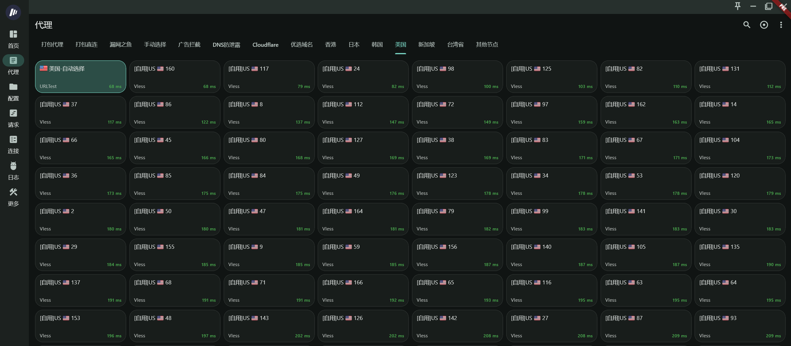

# best-cf-ipv4
## 项目功能
- 为多个公开或开源Cloudflare优选IP项目进行**聚合&去重&加地理标注&加国旗Unicode**，每3小时更新。  
- 可接入 [cmliu/edgetunnel](https://github.com/cmliu/edgetunnel)-自定义订阅汇聚。  

## 应用效果
- 经代理客户端解析后，节点名称将显示**国家代码**以及**国旗**。
<p align="center">
  
</p>

## API：
- Raw：
```
https://raw.githubusercontent.com/LancelotRar/best-cf-ips/main/best-cf-ipv4.txt
```
- 免梯：
```
https://gh-proxy.org/https://raw.githubusercontent.com/LancelotRar/best-cf-ips/main/best-cf-ipv4.txt
```

## 感谢以下组织或团队的公开数据和尽心整理与测试      
- [bestcf](https://bestcf.pages.dev)
- [WeTest](https://www.wetest.vip/page/cloudfront/address_v4.html)
- [UOUIN](https://api.uouin.com/cloudflare.html)
- Tiancheng
- [Mia](https://t.me/MiaChatChannel)
- [Gslege](https://github.com/gslege/CloudflareIP)
- [IPDB](https://ipdb.api.030101.xyz/)
- [VPS789](https://vps789.com/cfip/?remarks=ip)
- [vvHan](https://cf.vvhan.com/)